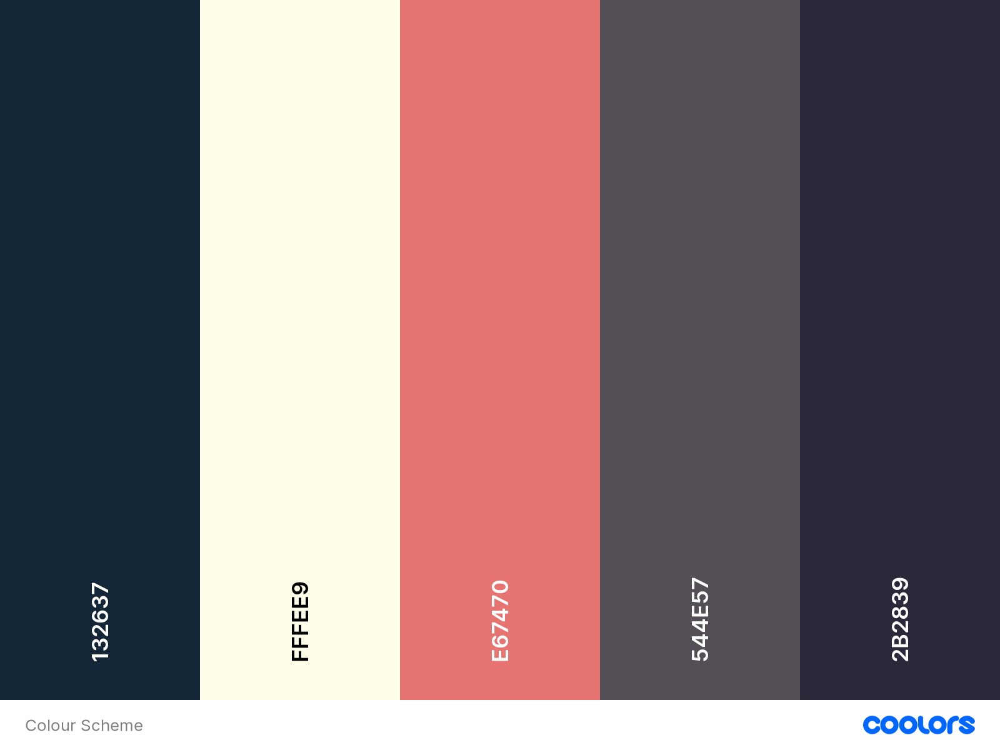

# Portfolio Website

This is my portfolio website, designed to showcase my projects, skills, and experiences. The website is built using Next.js, a React framework, with the following technologies:

- **Next.js**: Next.js is a React framework that enables server-side rendering, automatic code splitting, and easy page routing.
- **Tailwind CSS**: Tailwind CSS is a utility-first CSS framework that helps in quickly building custom designs without writing custom CSS.
- **TypeScript**: TypeScript is a statically typed superset of JavaScript that enhances developer productivity and code maintainability.

## Purpose

The primary goal of this project is to create a visually appealing and interactive portfolio website that effectively highlights my projects and skills. Additionally, I aim to learn Next.js while developing this website, enhancing my proficiency in React-based frameworks and improving my web development skills.

## Features

- **Project Showcase**: Displaying my projects with detailed descriptions, screenshots, and links to live demos or GitHub repositories.
- **Skills Highlight**: Showcasing my technical skills, technologies I'm proficient in, and areas of expertise.
- **About Me**: Providing information about my background, experience, and interests.
- **Contact**: Offering a way for visitors to get in touch with me, whether through a contact form or links to social media profiles.

## Colour Palette

## Getting Started

To run the project locally, follow these steps:

1. Clone this repository.
2. Install dependencies using `npm install`.
3. Run the development server using `npm run dev`.
4. Open [http://localhost:3000](http://localhost:3000) to view the website in your browser.